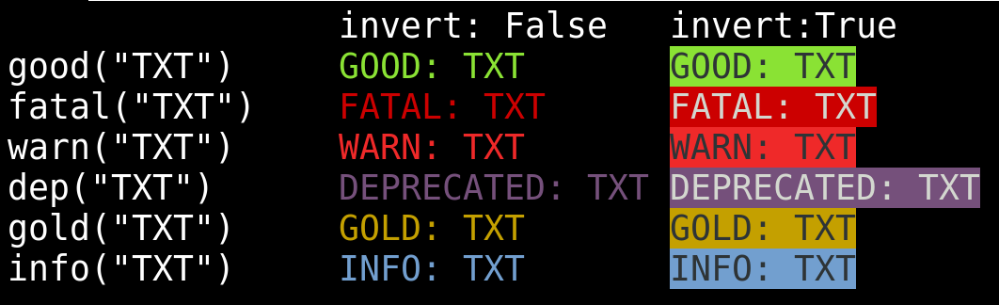

# colog
Color Log, shows colored log messages to screen

```python
from colog import colog

c=colog(True)
c.info("Starting up...")

if True:
        c.good("True is True!")
else:
        c.fatal("True is False?")
try:
        number+=1
except NameError as e:
        c.warn("Error occured: "+str(e))
```

Use `colog(True)` to invert messages
Below is a list of all combos:

